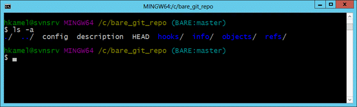
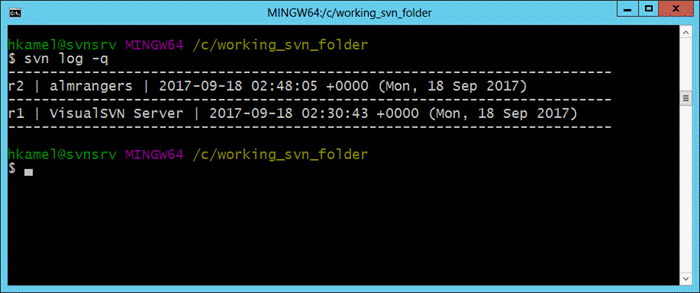
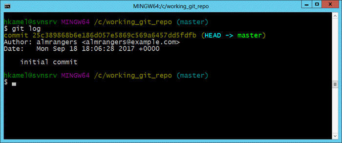

>
> #**THIS IS DRAFT.4.0 - WORK IN PROGRESS **
>

# Migrate from SVN to Git

SVN migrations to Git can vary in complexity, depending on how old the repository is and how many branches were created and merged, as well as if you use regular SVN or close relative like SVK to do the branching and merging. If you have a fairly new repository and the standard setup of a trunk, branches, and tags directory, the migration process could be straightforward. However if your team has done a lot of branching and merging, or your repository follows a non-standard directory setup, or that setup changed over time, the migration process could be considerably more complex.

There are several ways to migrate from SVN to Git. The approach outlined in this article is based on using [git-svn](https://git-scm.com/docs/git-svn), a Git extension which can be used to checkout a Subversion repository to a local Git repository and then push changes from the local Git repository back to the Subversion repository. These steps provide a detailed overview of the process for migrating from SVN to Git in a Windows environment, without synchronizing back to the original SVN repository. The end result will be a bare Git repository for sharing with the rest of your team.

> [!NOTE]
>
> Before you try to migrate your source code from a centralized version control system to Git, be sure that you familiarize yourself with the differences between centralized and distributed version control systems, and [plan your team’s migration](https://www.visualstudio.com/learn/centralized-to-git/). After you’ve prepared, you can begin the migration.

The high level workflow for migrating from SVN to Git is as follows:

* Prepare a migration environment
* Convert the source SVN repository to a local Git repository
* (Optional) - Synchronize the local Git repository with any changes from SVN repository while developers continue using SVN
* Push the local Git repository to a remote Git repository hosted on Visual Studio Team Services
* Lock SVN repository, synchronize any remaining changes from SVN repository to local Git repository and push final changes to VSTS remote Git repository
* Developers switch to Git as main source control system

## Prepare a migration environment

A migration environment should be configured on a local workstation. The following software will need to be installed on the migration workstation:

* [Git](https://git-scm.com/downloads)
* [Subversion](http://subversion.apache.org/packages.html)
* [git-svn utility](https://www.kernel.org/pub/software/scm/git/docs/git-svn.html) (already part of Git)

You will also need to create a Git repository on your VSTS account to host the converted SVN repository, you may follow [Create a new Git repo in your project
](https://docs.microsoft.com/en-us/vsts/git/create-new-repo)

## Convert the source SVN repository to a local Git repository

The goal of this step is to convert the source Subversion repository to a local *bare* Git repository. A *bare* Git repository does not have a local working checkout of files that can be modified. This is the recommended format for sharing a Git repository via a remote repository hosted on a service like VSTS.

> [!TIP]
> *bare* Git repositories are structured differently and given the fact that it doesn't have a working directory prevent direct commit to the repository.
>

### Retrieve a list of all Subversion authors

Subversion just uses the username for each commit. Git stores more data for each author but at a minimal, each commit will need a name and an email. By default, The git-svn tool will list the SVN username in the author and email fields. However, you can create a mapping file for SVN users along with their corresponding Git names and emails.

*Subversion users*


*Git users*


To extract a list of all SVN users, from the root of your local Subversion checkout, run this command:

```
svn log -q | awk -F '|' '/^r/ {sub("^ ", "", $2); sub(" $", "", $2); print $2" = "$2" <"$2">"}' | sort -u > authors-transform.txt
```
This command will retrieve all the log messages, extract the usernames, eliminate any duplicate usernames, sort the usernames and place them into a “authors-transform.txt” file. You can then edit each line in the file to create a mapping of SVN users to a well-formatted Git user. For example, you can map `almrangers = almrangers <almrangers> ` to `almrangers =  almrangers <almrangers@example.com>` .

### Clone the Subversion repository using git-svn

The following command will do the standard git-svn transformation using the authors-transform.txt file created in the previous step. It will place the Git repository in the "c:\mytempdir" folder in your local machine.
```
git svn clone ["SVN repo URL"] --prefix=svn/ --no-metadata --authors-file "authors-transform.txt" --stdlayout c:\mytempdir
```

> [!NOTE]
>
> The –prefix=svn/ is necessary because otherwise the tools can’t tell apart SVN revisions from imported ones. Setting a prefix (with a trailing slash) is strongly encouraged in any case, as your SVN-tracking refs will then be located at "refs/remotes/$prefix/", which is compatible with Git’s own remote-tracking ref layout (refs/remotes/$remote/).
>
> Setting a prefix is also useful if you wish to track multiple projects that share a common repository. By default, the prefix is set to origin/.

If you are using the standard trunk, branches, tags layout you’ll just put –stdlayout. However if you have something different you may have to pass the –trunk, –branches, and –tags in to identify what is what. For example if your repository structure was trunk/companydir and you branched that instead of trunk, you would probably want ‘–trunk=trunk/companydir –branches=branches‘.

```
git svn clone ["SVN repo URL"] --prefix=svn/ --no-metadata --trunk=/trunk --branches=/branches --tags=/tags  --authors-file "authors-transform.txt" c:\mytempdir
```

> [!NOTE]
>
> This command can take a few minutes to several hours depending on the size of the SVN repository. Upon completion, you will have a Git checkout of your repository.

### Convert version control-specific configurations

If your svn repo was using svn:ignore properties, you can  convert this to a .gitignore file using:
```
cd c:\mytempdir
git svn show-ignore > .gitignore
git add .gitignore
git commit -m 'Convert svn:ignore properties to .gitignore.'
```
> [!TIP]
>
> Read more about .gitignore [Ignore file changes with Git](
https://docs.microsoft.com/en-us/vsts/git/tutorial/ignore-files?tabs=visual-studio)

### Push repository to a bare git repository

In this step, you will create a bare repository and make its default branch match SVN's trunk branch name.

1. Create a bare Git repository

```
git init --bare c:\new-bare.git
cd c:\new-bare.git
git symbolic-ref HEAD refs/heads/trunk
```
2. Push the local Git repository to the new bare Git repository
```
cd c:\mytempdir
git remote add bare c:\new-bare.git
git config remote.bare.push 'refs/remotes/*:refs/heads/*'
git push bare
```
3. Rename "trunk" branch to "master"
Your main development branch will be named “trunk” which matches the name it was in Subversion. You’ll want to rename it to Git’s standard “master” branch using:
```
cd c:\new-bare.git
git branch -m trunk master
```
4. Clean up branches and tags
git-svn makes all of Subversions tags into very-short branches in Git of the form “tags/name”. You’ll want to convert all those branches into actual Git tags or delete them.

### Migrate SVN tags to be Git tags

```
cd c:\new-bare.git
git for-each-ref refs/remotes/tags | cut -d / -f 4- | grep -v @ | while read tagname; do git tag "$tagname" "tags/$tagname"; git branch -r -d "tags/$tagname"; done

```

### Advanced migrations

### Create all the SVN branches as proper Git branches

While it's easy to create all SVN branches as a proper Git branches, we do recommend that you evaluate the following points before you proceed:

- In case of Feature branches – can you wait until they integrate to the trunk before migrating?

- In case of Release branches – does it make sense to keep SVN around for servicing?  If you migrate feature branches, are you prepared to service branches out of Git?

If you still want to migrate existing branches, then running the following command will help
```
git for-each-ref refs/remotes | cut -d / -f 3- | grep -v @ | while read branchname; do git branch "$branchname" "refs/remotes/$branchname"; git branch -r -d "$branchname"; done

```
> [!NOTE]
>
> This command can take a few minutes to several hours depending on the size of the SVN repository. Upon completion, you will have a Git checkout of your repository.

### Update your workflow

Moving from a centralized version control system to Git is more than just migrating code. Your team needs training to understand how Git is different from your existing version control system and how these differences affect day-to-day work. [Learn more](https://www.visualstudio.com/learn/centralized-to-git/).

## Reference information

- [Choosing the right version control for your project](https://docs.microsoft.com/en-us/vsts/tfvc/comparison-git-tfvc)
- [Learn Git](https://www.visualstudio.com/learn-git/)
- [Ignore file changes with Git](https://docs.microsoft.com/en-us/vsts/git/tutorial/ignore-files?tabs=visual-studio)
- [Migrate from TFVC to Git](https://www.visualstudio.com/learn/migrate-from-tfvc-to-git/_)

> Authors: Hosam Kamel, William H. Salazar

*(c) 2017 Microsoft Corporation. All rights reserved. This document is
provided "as-is." Information and views expressed in this document,
including URL and other Internet Web site references, may change without
notice. You bear the risk of using it.*

*This document does not provide you with any legal rights to any
intellectual property in any Microsoft product. You may copy and use
this document for your internal, reference purposes.*
