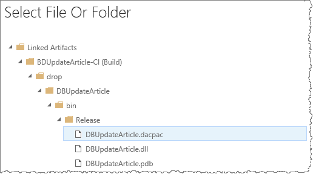
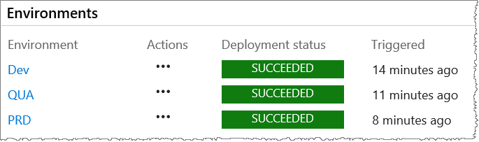
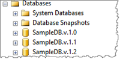

> 
> #**THIS IS DRAFT.1 - WORK IN PROGRESS **
> 

# Manage database upgrades

Are you planning to upgrade your production database? You probably have a few questions, such as:

- How can I include my databases in the DevOps process?
- How can I automate the database upgrades?
- How can I overcome known challenges and risks?

This topic aims to answer this and give you a few recipes to manage your upgrades.

## Automation is key

Databases are a complex set of artifacts that usually require a significant amount of effort to deploy. They evolve with your solutions, both structure and data wide. It's crucial that you include them in your DevOps process.

Automation provides a trustworthy strategy for deploying change. It promotes consistency, improves traceability, removes human error, and enables your database to mature with your solution.

## Considerations

Databases present a unique set of upgrade challenges. With other artifacts, for example web services or web applications, you can use clusters and load balancing to deploy to a subset of servers. Let's explore some of the considerations you need to consider when planning your database upgrade, such as:

- Dealing with multiple environments
- Deploying schema and data
- 24x7 availability
- Backwards compatibility
- Database recovery

### Dealing with multiple environments

Your databases may contain different data for each environment.

- **Users accessing the databases** - it's typical for applications to be implemented in segregated environments, using different domains, and enforcing  access.
- **Environment specific configuration data** - configuration data, for example web services endpoints and linked server destinations, may be stored in the databases, and require different values in each environment.

### Deploying schema and data

When updating your database, you could deploy schema and data changes.

- **Modify the database schema** - add new tables, append columns to tables, or create and update indexes.
- **Creating and updating data** - insert new data into tables, update existing data, and validate that data has been correctly modified.

### 24x7 availability

Deploying database changes to high-availability and critical systems, for example financial or military systems, is a challenge.

- **Downtime has significant impact** - user dissatisfaction or worse, a sense of distrust in the platform. 
- **Backups and restore are not a recovery option** - every action must be part of a forward moving process.

### Backward compatibility

It's likely that your databases need to support multiple versions of your solution. You need to maintain backward compatibility with all existing versions and support recovery for each.

### Database recovery

When something goes terribly wrong, for example data corruption, it's important that you're able to recover your database and data. You typically roll-forward by performing operations that restore previous version of your database, undo and validate data changes.

For example, a change may require a column to change its type. Your roll-forward strategy could be to create a new column with the new type, cast the old column values to the new type, and fill update the new column.

- **If you never delete the old column** - delete only the new column and revert any code (for example views and store procedures) which refers to the new column. This scenario becomes complex if new values are added to the new column during the roll-forward.
- **If you delete the old column** - re-create the old column and cast the values back. Once again, the scenario becomes complex if new values are added to the new column, risking cast back failure to the old column.

## Solutions

Based on the considerations we covered, let's have a look at some of the automation you can consider for the deployment of your database.

- Data-Tier Applications
- Custom approaches
	- Manually generate scripts
	- Version databases in development environment
	- Version databases and script differences
	- Use Red Gate data tools

### Data-Tier Applications

A [data-tier applications](https://docs.microsoft.com/en-us/sql/relational-databases/data-tier-applications/data-tier-applications) (DAC) is a logical database management entity that defines all the artifacts contained in the database. For example: tables, views, stored procedures and login objects. A portable package (DACPAC) is used to deploy schema changes, or a BACPAC to deploy schema and data changes. Read  [Import Source: Database or Data-tier Application](https://msdn.microsoft.com/en-us/library/hh864423(v=vs.10)), for options to import artifacts from a live database, and [linked servers](https://docs.microsoft.com/en-us/sql/relational-databases/linked-servers/linked-servers-database-engine) to access objects from another database. 

To get started, you can import an existing database, or create an empty SQL Server Database project with the SQL Server Data Tools (SSDT) through Visual Studio IDE.

> [!TIP]
> If you have are references to a very large Database, like an ERP database, start by creating a script with the relevant subset of the schema, then import that script to your database project. You can use SQL Server Management Studio to connect to the database and generate the script for the required objects. For more information please check [Generate Scripts](https://docs.microsoft.com/en-us/sql/relational-databases/scripting/generate-scripts-sql-server-management-studio).

Once built, your SSDT project will generate a file with ***.dacpac** extension. It contains all the information needed to deploy the database changes and enables you to orchestrate your continuous integration and delivery (CI/CD) flow.

- **Create your build definition** - Read [CI/CD for newbies](https://www.visualstudio.com/en-us/docs/build/get-started/ci-cd-part-1) to get started.

- **Create your target databases** - In the example below, we've created four databases. These can be Azure SQL or SQL Server databases. The first one is used for development and others are the target deployments for three environments. 

	

- **Create your release pipeline**

	- Select **Build & Release > Releases > New Definition > Empty > Next**.

	- From the Artifacts, select your **Project**, the **Source (Build definition)**, and **Create** the release definition.

	- **OPTION A - Deploy to a Azure SQL database**
		- Add an **Azure SQL Database Deployment** task from the task catalog.

			

		- Select your **Azure Connection Type** and **Azure RM Subscription**.

			

		- Configure the **SQL DB Details**.

			

		- Select the **SQL DACPAC File** generated for your database.

			

	- **OPTION B - Deploy to a SQL Server database**

		- There are no out-of-the-box tasks for SQL Server, but you can leverage existing Marketplace extensions. For example [IIS Web App Deployment Using WinRM](https://marketplace.visualstudio.com/items?itemName=ms-vscs-rm.iiswebapp).

		- Add an **WinRM - SQL Sever DB Deployment** task from the task catalog.

			

		- Select one of the deployment strategy, for example **Sql Dacpac**.

			

		- Configure the deployment options. Here's an example:

			

- **Test your release definition** - Before moving to other environments, you should test your release definition by creating a release.

	- Select **Release > Create Release**.

		

	- If all the configurations are correct, you'll get a **SUCCEEDED** result and a target database with all the artifacts that existed in the original database.

		
	
- **Replicate your environment** - You can now clone the environment you just created.

	- From your first environment context menu, select **Clone Environment**.

		

	- Make the necessary changes to the cloned release configuration.

	- Repeat the process by cloning your second environment.

You now have a CI/CD pipeline, with three environments, targeting three different databases. By default approvals for each environment are configured to be automatic.

You should consider adding validation tests and manual approvals between environments.

**What about possible data loss during deployments?** - The default option is to block schema changes that could potentially result in data loss, but you could override it: **/p:BlockOnPossibleDataLoss=True/False**. (For details, read [SqlPackage.exe](https://msdn.microsoft.com/en-us/library/hh550080.aspx)).

**What about possible data conflicts during deployments?** - You can consider different strategies to avoid conflicts from occurring. For example, leverage the post- and pre- deployment script support in DAC. It gives you additional control over conflicts that might occur, and how to resolve them.

**What about backups?** - Database backups should always be part of your pipeline, unless your business doesn’t allow you to restore. Be aware that backups can take a significant amount of time and will impact the overall execution time of your pipeline. 

> TIP!
>

### Custom approaches

While we recommend the use of [data-tier applications](https://docs.microsoft.com/en-us/sql/relational-databases/data-tier-applications/data-tier-applications), you have other approaches to consider, such as:

- Manually generate scripts
- Version databases in development environment
- Version databases and script differences
- Use Red Gate data tools

#### Manually generate scripts

Probably the most common approach we encounter is still to manage the database change scripts manually. This process is complex and error prone. Having multiple environments will involve an expensive amount of effort to manage the scripts for each environment. 
Here’s how you can automate your scripts in your release pipeline:
- Create a script which lists all **.sql** files in a path that’s accessible by your agents.

> [!TIP]
> 
> Use a file naming convention for the **.sql** files that contains the sequence (for example #1_CreateNewTable.sql, #2_CreateNewView.sql, etc.) in which they should be run. List the **.sql** files with an ascending sort, to define the correct sequence when they are run.

- Add the Batch Script or Command Line task to your release pipeline.
- Configure the task to execute each of the *.sql files using [SQLCMD.EXE](https://docs.microsoft.com/en-us/sql/tools/sqlcmd-utility). 
You must ensure that the *.sql files can be executed several times. For example, before updating a schema, the scripts needs to validate if the update has already been applied.

#### Version databases in development environment

If you are maintaining manually created scripts, you can evolve your environment and maintain a database for each version your solution.

 
You can use tools, such as the [SSDT’s Schema Compare](https://msdn.microsoft.com/en-us/library/hh272690(v=vs.103).aspx), to generate the differences between the database versions.

#### Version databases and script differences

You can take versioned databases one step further, by creating a Visual Studio solution with a project for each database version.

 
During your CI build, you can run tools, such as **vsdbcmd.exe**, to generate *.sql files with statements to update the database. You can then apply the .sql files during the CD release if the target database has a matching version.

#### Use Red Gate data tools

If you’re using Visual Studio 2017 you can consider the [Red Gate](https://www.red-gate.com/) data tools set. They extend DevOps practices to SQL Server and Azure SQL databases and increase your productivity while doing database development. 
Use the [Redgate ReadyRoll VSTS/TFS plugin](https://marketplace.visualstudio.com/items?itemName=redgatesoftware.redgate-readyroll) to automate the deployment of changes in your CD pipeline. (Read [Redgate Data Tools in Visual Studio 2017](https://blogs.msdn.microsoft.com/visualstudio/2017/03/07/redgate-data-tools-in-visual-studio-2017/) for a walk-through of the process).

## Conclusion and lessons learned

Database deployment is a complex process and comes with a considerable amount of risk. Knowing that is paramount for you to manage the risk and choosing the deployment approach that is right for you. It's important to design the database, its deployment and upgrades from the start. Considering future changes and how to manage change will  influence how you'll design and maintain your databases in a positive way.

Now that you've covered some of the considerations and options of automating the database upgrades, you should explore ways to improve your CI/CD pipelines. This topic is vast and certainly there's much more to talk about. We'd appreciate and are looking forward to your feedback and opinions. 

##Reference information
- [Rollbacks with Automated Database Deployments](http://www.codeaperture.io/2016/09/18/rollbacks-with-automated-database-deployments/)
- [Avoiding Database Migration Pitfalls with Continuous Software Delivery](https://devops.com/avoiding-database-migration-pitfalls-with-continuous-software-delivery/)
- [Closing the Gap Between Database Continuous Delivery and Code Continuous Delivery](https://devops.com/closing-gap-database-continuous-delivery-code-continuous-delivery/)
- [How to Automate the Database for DevOps Success](https://blog.xebialabs.com/2016/11/03/devops-database-automation-yes-you-can/)
- [How Database Administration Fits into DevOps](https://www.infoq.com/news/2016/01/database-administration-devops)
- [How Do Databases Fit Into DevOps?](https://www.devopsguys.com/2015/02/19/how-do-databases-fit-into-devops/)
- [Redgate Data Tools in Visual Studio 2017](https://blogs.msdn.microsoft.com/visualstudio/2017/03/07/redgate-data-tools-in-visual-studio-2017/)
- [Using Visual Studio database projects in real life](https://weblogs.asp.net/gunnarpeipman/using-visual-studio-database-projects-in-real-life)

> Authors: Rui Carrilho de Melo, Rodrigo Antunes, João Paulo Rodrigues | Find the origin of this article and connect with the ALM Rangers [here](https://github.com/ALM-Rangers/Guidance/blob/master/README.md)
 
*(c) 2017 Microsoft Corporation. All rights reserved. This document is
provided "as-is." Information and views expressed in this document,
including URL and other Internet Web site references, may change without
notice. You bear the risk of using it.*

*This document does not provide you with any legal rights to any
intellectual property in any Microsoft product. You may copy and use
this document for your internal, reference purposes.*
