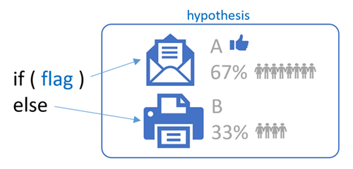

> 
> #**THIS IS DRAFT.1 - WORK IN PROGRESS **
> 

# Phase the features of your application with feature flags

In today's fast-paced, feature-driven markets, it is imperative to be able to deliver value and receive feedback on features quickly and continuously. Partnering with end-users to get early versions of features vetted out is extremely valuable.

Are you planning to continuously integrate features into your application while they're under development? You probably have a few questions, such as:

- How can you toggle features to hide, disable, or enable features at run-time?
- How can you revert a change deployed to production without rolling back your release?
- How can you present users with variants of a feature, to determine which one performs better?

This topic aims to answer this and share our implementation of feature flags (FF) and A|B testing, within our production infrastructure for DevLabs extensions.

## Considerations

Before you introduce feature flags to your engineering process, it's important to consider the following:

- Which users are you planning to target? For example do you want to target specific users, all users, or both?
- Would you like users to decide which features they want to use?
- What's the value of embracing feature flags as part of your engineering process?
- What's the cost implement feature flags in your engineering process?

## What are Feature Flags (FF)?

> [!NOTE]
> A feature flag is also known as a feature toggle, feature switch, feature flipper, or conditional feature.

A feature flag is a technique to enable (expose) or disable (hide) a feature in a solution. It allows us to release and test features, even before they are fully developed and ready for release. It's an alternative to maintaining multiple source-code branches and a low-risk companion for releasing, managing and fine-tuning features in production.

A feature flag can be viewed as an ON | OFF switch for a specific feature. As shown, we can deploy a solution to production that includes both an email and a print feature. If the feature flag is set (ON), we'll email. If reset (OFF) we'll print.

When we combine a feature flag with an experiment, led by a hypothesis, we introduce A|B testing. For example, we could run an experiment to determine if the email (A) or the print (B) feature will result in a higher user satisfaction. 

As shown, the majority of users prefer the email feature. Option (A) is more popular with the users and wins.

## What FF solution did we chose?

As outlined in [How to implement feature flags and A|B testing](https://blogs.msdn.microsoft.com/visualstudioalmrangers/2017/04/04/how-to-implement-feature-flags-and-ab-testing/) we considered a number of FF frameworks and solutions. We chose the [LaunchDarkly](https://launchdarkly.com/index.html) solution for a number of reasons:

- It’s a software as a service (SaaS) solution.
	- No custom solution to maintain.
	- No upgrades - we're always using the latest and greatest.
	- No servers - LaunchDarkly takes care of the machines that LaunchDarkly runs on.
	- Always on and optimized for the Internet.
- It's integrated with Visual Studio Team Services and Team Foundation Server.
- It's simple and cost-effective to configure and use in our community space.

## Common Scenarios

@

**Enable | disable a feature for everyone**

**Enable | disable a feature for selected users**

@

**Enable | disable a feature as selected by user**

@

## Managing features with feature flags in our engineering process

@

## What's the value?

@

## Conclusion

Now that you've covered the concepts and considerations of feature flags, and our implementation of them, you should be confident to explore ways to improve your CI/CD pipelines. While feature flags come at a cost, having a game plan to manage exposure features at run-time is invaluable.

## Q&A

### Is there a dependency on feature flags?

No, rings and feature flags are symbiotic. Read [Phase the roll-out of your application through rings](https://www.visualstudio.com/en-us/articles/phase-rollout-with-rings) for details.

##Reference information
- [Phase the roll-out of your application through rings](https://www.visualstudio.com/en-us/articles/phase-rollout-with-rings)
- [How to implement feature flags and A|B testing](https://blogs.msdn.microsoft.com/visualstudioalmrangers/2017/04/04/how-to-implement-feature-flags-and-ab-testing/)
- [CI/CD pipeline examples](https://blogs.msdn.microsoft.com/visualstudioalmrangers/tag/cicd-pipeline/)

> Authors: Willy Schaub | Find the origin of this article and connect with the ALM Rangers [here](https://github.com/ALM-Rangers/Guidance/blob/master/README.md)
 
*(c) 2017 Microsoft Corporation. All rights reserved. This document is
provided "as-is." Information and views expressed in this document,
including URL and other Internet Web site references, may change without
notice. You bear the risk of using it.*

*This document does not provide you with any legal rights to any
intellectual property in any Microsoft product. You may copy and use
this document for your internal, reference purposes.*
