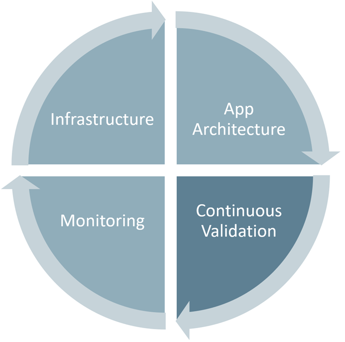
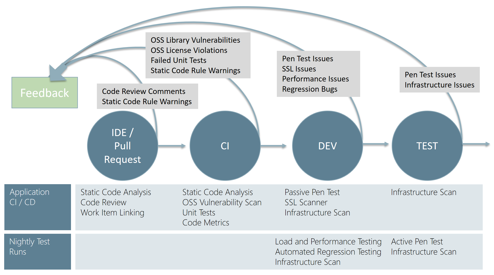
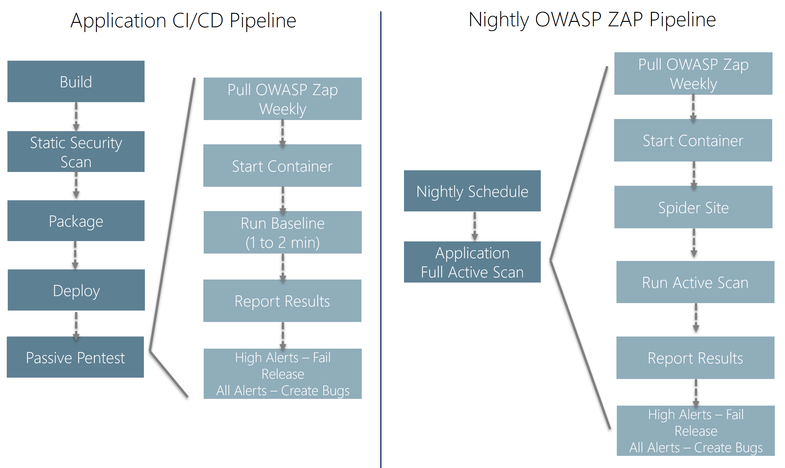
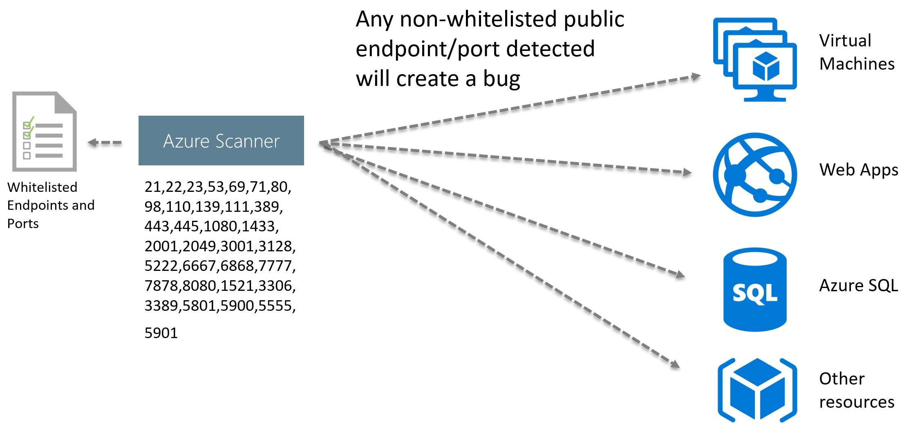
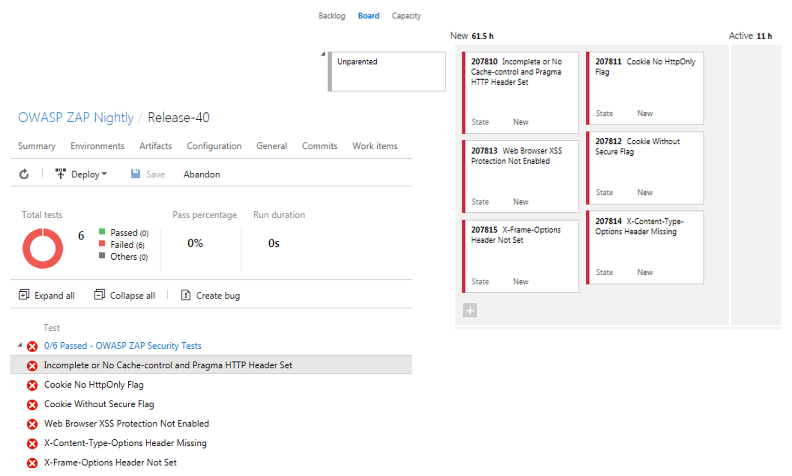

> 
> #**THIS IS DRAFT.3 - WORK IN PROGRESS **
> 

# Adding Continuous Security Validation to your CI/CD Pipeline

Are you planning Visual Studio Team Services (VSTS) continuous integration and deployment pipelines? You probably have a few questions, such as:
- How do you ensure your application is safe?
- How do you add continuous security validation to your CI/CD pipeline?

DevOps practices are allowing businesses to stay ahead of the competition by delivering new features faster than ever before. As the frequency of production deployments increases, this business agility cannot come at the expense of security. With continuous delivery, how do we ensure our applications are secure and stay secure? How can we find and fix security issues early in the process? This begins with practices commonly referred to as DevSecOps.  DevSecOps incorporates the security team and their capabilities into your DevOps practices making security a responsibility of everyone on the team.  In this article, we'll walk through how to help ensure your application is secure by adding continuous security validation to your CI/CD pipeline.

Security needs to shift from an afterthought to being evaluated at every step of the process. Securing applications is a continuous process that encompasses secure infrastructure, designing an architecture with layered security, continuous security validation, and monitoring for attacks.

Continuous security validation should be added at each step from development through production to help ensure the application is always secure. The goal of this approach is to switch the conversation with the security team from approving each release to approving the CI/CD process and having the ability to monitor and audit the process at any time. When building greenfield applications, the diagram below highlights the key validation points in the CI/CD pipeline. Depending on your platform and where your application is at in its lifecycle, you may need to consider implementing the tools gradually. This is especially true if your product is mature and you haven’t previously run any security validation against your site or application.  

## IDE / Pull Request

Validation in the CI/CD begins before the developer commits his or her code. Static code analysis tools in the IDE provide the first line of defense to help ensure that security vulnerabilities are not introduced into the CI/CD process. The process for committing code into a central repository should have controls to help prevent security vulnerabilities from being introduced. Using Git source control in VSTS with branch policies provides a gated commit experience that can provide this validation. By enabling [branch policies](https://www.visualstudio.com/en-us/docs/git/branch-policies) on the shared branch, a pull request is required to initiate the merge process and ensure that all defined controls are being executed. The pull request should require a code review which is the one manual but important check for identifying new issues being introduced into your code. Along with this manual check, commits should be linked to work items for auditing why the code change was made and require a continuous integration (CI) build process to succeed before the push can be completed.

## CI (Continuous Integration)

The CI build should be executed as part of the pull request (PR-CI) process discussed above and once the merge is complete. Typically, the primary difference between the two runs is that the PR-CI process doesn’t need to do any of the packaging / staging that is done in the CI build. These CI builds should run static code analysis tests to ensure that the code is following all rules for both maintenance and security. Several tools can be used for this.

- [Visual Studio Code Analysis and the Roslyn Security Analyzers](https://blogs.msdn.microsoft.com/secdevblog/2016/03/30/roslyn-diagnostics-security-analyzers-overview/)

- [Checkmarx](https://www.checkmarx.com/) – A Static Application Security Testing (SAST) tool

- [BinSkim](https://github.com/Microsoft/binskim) – A binary static analysis tool that provides security and correctness results for Windows portable executables

- [Other 3rd party tools](https://blogs.msdn.microsoft.com/devops/2016/10/11/team-services-october-extensions-roundup-rugged-devops/)

Many of the tools seamlessly integrate into the VSTS build process. Visit the VSTS Marketplace for more information on the integration capabilities of these tools.

In addition to code quality being verified with the CI build, two other tedious or completely ignored validations are scanning 3rd party packages for vulnerabilities and OSS license usage. Often when we'll ask about 3rd party package vulnerabilities and the licenses, the response is fear or uncertainty. Those organizations that are trying to manage 3rd party packages vulnerabilities and/or OSS licenses, explain that their process for doing so is tedious and manual. Fortunately, there are a couple of tools by [WhiteSource Software](https://www.whitesourcesoftware.com/) that can make this identification process almost instantaneous. The tool runs through each build and reports all of the vulnerabilities and the licenses of the 3rd party packages. WhiteSource Bolt is a new option which includes a 6 month license with your Visual Studio Subscription. Bolt provides a report of these items but doesn't include the advanced management and alerting capabilities that the full product offers. With new vulnerabilities being discovered regularly, your build reports could change even though your code doesn't. Checkmarx includes a similar WhiteSource Bolt integration so there could be some overlap between the two tools. See, [Manage your open source usage and security as reported by your CI/CD pipeline](https://blogs.msdn.microsoft.com/visualstudioalmrangers/2017/06/08/manage-your-open-source-usage-and-security-as-reported-by-your-cicd-pipeline/) for more information about WhiteSource and the VSTS integration.

## Application Deployment to DEV and TEST

Once your code quality is verified and the application is deployed to a lower environment like development or QA, the process should verify that there are not any security vulnerabilities in the running application. This can be accomplished by executing automated penetration test against the running application to scan it for vulnerabilities. There are different levels of tests that are usually categorized into passive tests and active tests. Passive tests scan the target site as is but doesn’t try to manipulate the requests to expose additional vulnerabilities. These can run very fast and are usually a good candidate for a CI process that you want to complete in a few minutes. Whereas the Active Scan can be used to simulate many techniques that hackers commonly use to attack websites. These tests can also be referred to dynamic or fuzz tests because the tests are often trying a large number of different combinations to see how the site react to verify that it doesn't reveal any information. These tests can run for much longer and typically you don't want to cut these off at any particular time. These are better executed nightly as part of a separate VSTS release.

One tool to consider for penetration testing is OWASP ZAP. [OWASP](https://www.owasp.org) is a not-for-profit worldwide organization dedicated to helping improve the quality of software. ZAP is a free penetration testing tool for beginners to professionals. ZAP includes an API and a weekly docker container image that can be integrated into your deployment process. The detailed how-to steps are outside the scope of this article. Please refer to the [oswa zap vsts extension](https://github.com/deliveron/owasp-zap-vsts-extension) repo for details on how to set up the integration. Here we're going to explain the benefits of including this into your process.

The application CI/CD pipeline should run within a few minutes so you don't want to include any long running processes. The baseline scan is designed to identify vulnerabilities within a couple minutes making it a good option for the application CI/CD pipeline. The Nightly OWASP ZAP can spider the website and run the full Active Scan to evaluate the most combinations of possible vulnerabilities. OWASP ZAP can be installed on any machine in your network but we like to use the OWASP Zap/Weekly docker container within Azure Container Services. This allows for the latest updates to the image and also allows being able to spin up multiple instances of the image so several applications within an enterprise can be scanned at the same time. The following figure outlines the steps for both the Application CI/CD pipeline and the longer running Nightly OWASP ZAP pipeline.

In addition to validating the application, the infrastructure should also be validated to check for any vulnerabilities. When using the public cloud such as Azure, deploying application and shared infrastructure is very easy, so it is important to validate that everything has been done in a secure manner. Azure includes many tools to help report and prevent these vulnerabilities including Security Center and Azure Policies. In addition, we have set up a scanner that can ensure any public endpoints and ports have been whitelisted or else it will raise an infrastructure issue. This is run as part of the Network pipeline to provide immediate verification but it also needs to be executed each night to ensure that there aren’t any resources publicly exposed that should not be.

Once the scans have completed, the VSTS release is updated with a report that includes the results and bugs are created in the team's backlog. Resolved bugs will close if the vulnerability has been fixed and move back into in-progress if the vulnerability still exists.

The benefit of using this is that the vulnerabilities are created as bugs that provide actionable work that can be tracked and measured. False positives can be suppressed using OWASP ZAP’s context file so only vulnerabilities that are true vulnerabilities are surfaced.

Even with continuous security validation running against every change to help ensure new vulnerabilities are not introduced, hackers are continuously changing their approaches and new vulnerabilities are being discovered. Good monitoring tools allow you to help detect, prevent, and remediate issues discovered while your application is running in production. Azure provides a number of tools that provide detection, prevention, and alerting using rules such as OWASP Top 10 / modSecurity and now even using machine learning to detect anomalies and unusual behavior to help identify attackers.

Minimize security vulnerabilities by taking a holistic and layered approach to security including secure infrastructure, application architecture, continuous validation, and monitoring. DevSecOps practices enable your entire team to incorporate these security capabilities throughout the entire lifecycle of your application.  Establishing continuous security validation into your CI/CD pipeline can allow your application to stay secure while you are improving the deployment frequency to meet needs of your business to stay ahead of the competition.

##Reference information

- [BinSkim](https://github.com/Microsoft/binskim) – A binary static analysis tool that provides security and correctness results for Windows portable executables
- [Checkmarx](https://www.checkmarx.com/) – A Static Application Security Testing (SAST) tool
- [Manage your open source usage and security as reported by your CI/CD pipeline](https://blogs.msdn.microsoft.com/visualstudioalmrangers/2017/06/08/manage-your-open-source-usage-and-security-as-reported-by-your-cicd-pipeline/)
- [OWASP](https://www.owasp.org)
- [OSWAP zap vsts extension](https://github.com/deliveron/owasp-zap-vsts-extension)
- [WhiteSource Software](https://www.whitesourcesoftware.com/)
- [Visual Studio Code Analysis and the Roslyn Security Analyzers](https://blogs.msdn.microsoft.com/secdevblog/2016/03/30/roslyn-diagnostics-security-analyzers-overview/)

> Authors: Mike Douglas | Find the origin of this article and connect with the ALM Rangers [here](https://github.com/ALM-Rangers/Guidance/blob/master/README.md)
 
*(c) 2017 Microsoft Corporation. All rights reserved. This document is provided "as-is." Information and views expressed in this document, including URL and other Internet Web site references, may change without notice. You bear the risk of using it.*

*This document does not provide you with any legal rights to any intellectual property in any Microsoft product. You may copy and use this document for your internal, reference purposes.*
