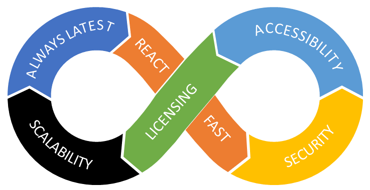
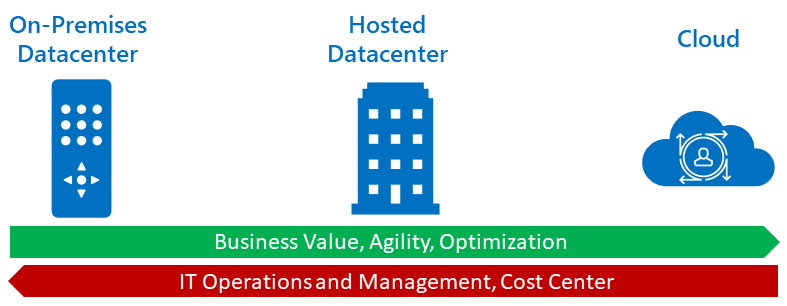
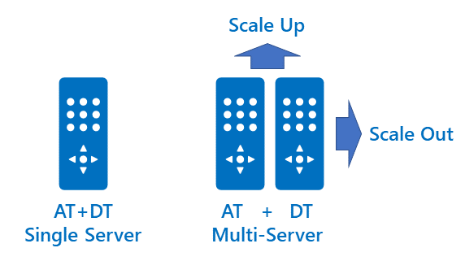
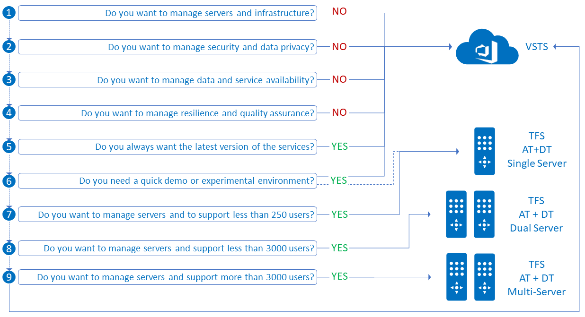

# Understand your options for planning a TFS and VSTS engineering environment

Are you planning to use Team Foundation Server (TFS) or Visual Studio Team Services (VSTS) as the collaboration solution for engineering teams to take an idea, plan, develop, test, release, and monitor their solutions? You probably have a few questions, such as:

- What deployment options are there?
- Do I choose on-premises, infrastructure as a service (IaaS), or software as a service (SaaS)?
- Do I choose one or more Team Projects and Teams?

This article aims to answer those questions, and give you a perspective on deployment options, high availability, capacity planning, and other considerations covered in detail in the dated, but still current [TFS Planning, Disaster Avoidance and Recovery](https://vsardata.blob.core.windows.net/projects/Rangers_vsarPlanninglGuide_Everything.zip) guidance.

## Why you should consider VSTS

Consider VSTS when you want quick setup, maintenance-free operations, easy collaboration across domains, elastic scale, rock solid security, with access to cloud load testing, cloud build servers, and application insights. It provides a scalable, reliable, backed by a 99.9% SLA, monitored 24x7, and available in local data centers around the world.

While both TFS and VSTS provide the same essential services, VSTS provides your organization these added benefits:

- **Always Latest** - No more expensive and complex upgrade cycles to manage your data center. You always have access to the latest version of the service, with optional access to preview features.
- **CAPEX -> OPEX** - No servers and infrastructure to support, manage, and upgrade. You can move your organizations from resource optimized model, based on capital expenses (CAPEX), to a market optimized business model, based on operational expenses (OPEX).
- **Ease of use** - Easy access from anywhere, with improved connectivity with remote sites, and control when you need it. 
- **React Fast** - The VSTS live-site management processes are crafted to ensure a deep focus on service health and customer experience, to minimize time to detect, respond to, and mitigate business impacting issues. You have fast access to patches and bug fixes. 
- **Scalability** - Automatically scales with your needs, with resilience and quality assurance. Read [how Microsoft builds its fast and reliable global network](https://azure.microsoft.com/en-gb/blog/how-microsoft-builds-its-fast-and-reliable-global-network/) to understand how Microsoft is continuously innovating and investing in their cloud.
- **Security** - VSTS is hosted entirely in Microsoft Azure datacenters and uses many of the core Azure services including Compute, Storage, Networking, SQL Database, Identity and Access Management Services, and Service Bus. This ensures that VSTS takes advantage of the state of the art capabilities, protection, and industry certifications available from the Azure platform. You get data protection by the experts for data availability, service availability, service security, and data privacy. For details on security, read [Data Protection Overview](https://aka.ms/vsts-security).
- **Licensing** - Simplified licensing allows you to transition from a capital expenditure (servers and the like) to operational expenditure (subscriptions).

## Deployment Options

[Team Foundation Server](https://visualstudio.microsoft.com/tfs) (TFS) and Visual Studio Team Foundation Server (VSTS) both provide an integrated collaboration solution. To [understand differences between VSTS and TFS](https://docs.microsoft.com/en-us/vsts/user-guide/about-vsts-tfs?view=vsts), read [Essential Services](https://docs.microsoft.com/en-us/vsts/user-guide/services?view=vsts).

[VSTS](https://visualstudio.microsoft.com/team-services/) is the recommended software as a service (SaaS) cloud offering on the far right.

You can deploy TFS in your on-premises datacenter, a hosted datacenter, or a hybrid infrastructure. A transition to a hosted datacenter allows your business to win agility and flexibility, reduce capital expenditure, deliver your applications and services to the business cheaper and more effectively, and enable your digital transformation.

For TFS there are a few deployment options. 

- **Single-server** hosts both the application tier (AT) and the data tier (DT) on a single server. Build, release, test, and proxy servers are optional features and can be deployed on the same or separate servers. A suitable option if you're looking for an easy to use and shareable demo or experimental environment, or simplicity in terms of infrastructure management.
- **Dual Server (scale up)** starts with the application and the data tiers on separate servers. When you are “scaling up,” you are adding resources to a single node in the system, for example, more CPU, memory or disk space.
- **Multi-server (scale out)** also starts with the application and the data tiers on separate server. However, when you add resources, you add a new node to the system to distribute load and achieve greater capacity. For example, you can add a new server to the application tier to distribute user request load. The scale-out option also adds redundancy and performance by adding additional application and data tier servers. A typical data tier is implemented using SQL Server instances and the application tier by network load balancing (NLB) two or more application tier servers.

## Capacity Planning

To decide which of the TFS deployment options are viable, you need to consider the advantages of each option, the number of users and projects you will need to support and understand the expected requests per second (RPS) per application tier (AT) server. 

The following table is a quick summary of the three deployment options, with a conservative suggested maximum number of users. For a more detailed breakdown of the scenarios and recommended hardware, use the capacity planning workbook from the [TFS Planning, Disaster Avoidance and Recovery](https://vsardata.blob.core.windows.net/projects/Rangers_vsarPlanninglGuide_Everything.zip) guidance.

|Deployment Option|Requests per second (RPS)|Max Users|
|-----------------|--:|--------:|
|Single Server|92-180|250-500|
|Dual Servers (scale up)|476-730|2200-3600|
|Multi Servers (scale out)|730+|3600+|

>
> [!TIP]
>
> The dual and multi server options allow you to scale your TFS environment as your organization or number of power users grow. You can change the deployment option and migrate to VSTS at a later stage. See [Migration options](https://docs.microsoft.com/en-us/vsts/articles/migrate-to-vsts-from-tfs?view=vsts) to review migration approaches.
>

If you have remote sites, sharing code with your main TFS server site, the [Team Foundation Server Proxy](https://docs.microsoft.com/en-us/tfs/server/install/install-proxy-setup-remote) helps to cache recently used version control files, improve remote user experience, and reduce network load.

## Conclusion

VSTS enables you to start small, take your solution from idea to release, scale-up as needed, and leave the support and maintenance of services to the experts.

It's only when you want to manage servers and services yourself that the on-premises or virtualized TFS single, dual, and multi server scenarios (7-9) are recommended.

>
> [!NOTE]
>
> If you want to focus on delivering **business value** and delegate data center operations, security, monitoring, and 24x7 support to the experts, then VSTS is for you!
>

## Reference Information

- [Essential Services](https://docs.microsoft.com/en-us/vsts/user-guide/services?view=vsts)
- [Team Foundation Server (TFS)](https://visualstudio.microsoft.com/tfs) 
- [TFS Planning, Disaster Avoidance and Recovery](https://vsardata.blob.core.windows.net/projects/Rangers_vsarPlanninglGuide_Everything.zip) guidance
- [Understand differences between VSTS and TFS](https://docs.microsoft.com/en-us/vsts/user-guide/about-vsts-tfs?view=vsts)
- [Visual Studio Team Services (VSTS)](https://visualstudio.microsoft.com/team-services/)
- [VSTS SSH on Azure’s Global Network](https://blogs.msdn.microsoft.com/devops/2017/10/23/vsts-ssh-on-azure-global-network/)
- [Why move to VSTS in the Cloud](https://1drv.ms/p/s!AnFDv11RH3N2bXAED61fZ-kePzY)

>
> Author: Willy Schaub | Find the origin of this article and connect with the ALM | DevOps Rangers [here](https://github.com/alm-rangers/guidance).
>
> Reviewers: Hasaan Fadili, Ken Muse, and Mike Fourie
>

*(c) 2018 Microsoft Corporation. All rights reserved. This document is provided "as-is." Information and views expressed in this document, including URL and other Internet Web site references, may change without notice. You bear the risk of using it. 
This document does not provide you with any legal rights to any intellectual property in any Microsoft product. You may copy and use this document for your internal, reference purposes.*
