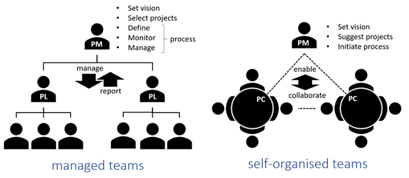
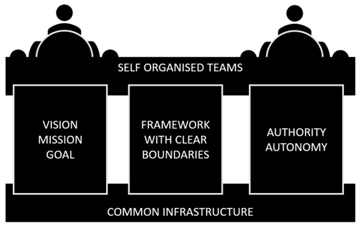
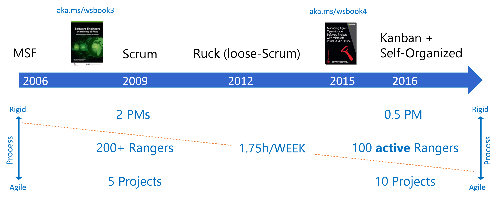
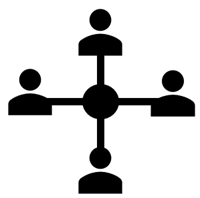
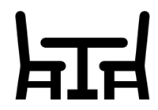
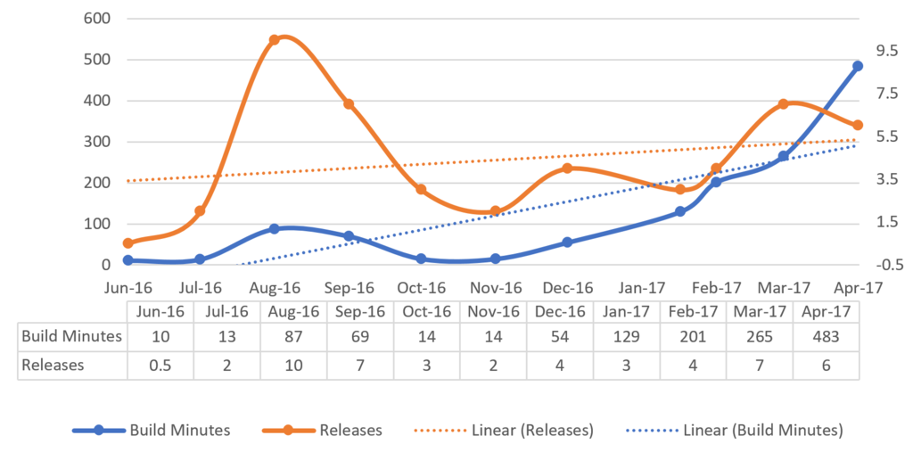
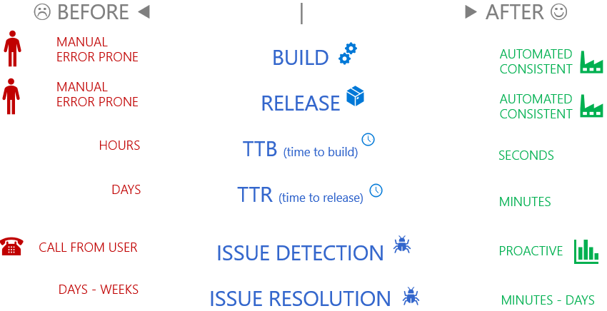
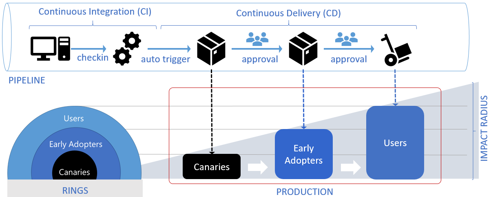

> ------------------------------------------
> 
> **WORK IN PROGRESS** - DO NOT DISTRIBUTE
> 
> Images - high-quality, 737 pixels wide
>
> DRAFT.5 - BUSY WITH COPY-EDIT REVISIONS AS PER **TODO**s
> 
> -----------------------------------------

## Introduction
In 2015, the ALM Rangers moved from a traditional organization to a *self-organizing team*. This article is an overview of the process that we used and the results that we saw as a result of the change. Read this article to decide if a similar transformation would be beneficial to your own organization.

> **Who should read this article?**
> The answer is simple: any organization, individual, or company looking to streamline their teams and processes. If you’re looking for > a more manageable, intuitive way to work on projects; or if your members (like the Rangers) are scattered all over the planet, then
> this article is for you.

### A brief preamble

For many years, we've been evaluating and implementing Agile practices across our geographically distributed, part-time, and volunteer teams and team members. We shared our learnings in the [Managing Agile OSS Projects with Microsoft VSO](https://blogs.msdn.microsoft.com/microsoft_press/2015/04/09/free-ebook-managing-agile-open-source-software-projects-with-microsoft-visual-studio-online/) eBook, but we realized we're not done. We need to scale, and more importantly, deliver value to our developer community quickly. 

We embarked on a cultural shift that allowed us to “rub DevOps” on our operational processes and embrace self-organized, self-managed and autonomous teams. This article explores self-organized teams, our journey, and behavioural patterns we observed. 

> [!NOTE]
> Whether you read the entire article or cherry-pick topics, please bear in mind that there is no silver bullet or "one size fits all" solution. The patterns and recommendations covered herein may or may not apply to your organization. If they do, we hope we'll enable a successful transformation for your teams. If not, we'd appreciate [your candid feedback](mailto:ADDRESS_HERE) so that we can update this article.

> **TODO:WILLY** - **ADD CONTACT DETAILS AND REDUCE SECTION FROM START TO NEXT TODO**

#### Learn from our history

> “*I have not failed. I've just found 10,000 ways that won't work.*” - Thomas A. Edison

We’ve gone through the 10,000 failures so you don’t have to. Our goal is to provide you with an understanding of self-organized teams and how they revolutionized the Rangers so that you can put it to work for your organization. Although we are continually adapting our methods, what we’ve learned is an invaluable resource to us, and hopefully to you as well.

In 2009, the Rangers had two full-time Program Managers and five concurrent projects running. After moving to self-organizing teams, we have one part-time Program Manager and ten concurrent projects running. Communication is faster. Efficiency is greater. Headaches are fewer. 

#### Avoid the pain of what didn't work

As stated in the last section, we’ve already gone through the arduous trial-and-error process. Traditional managed teams have their place, but companies are changing. For example, the Rangers are comprised of a diverse and widely dispersed group of application lifecycle management (ALM) experts from all over the globe. Traditional management became a hindrance to productivity due to the expansive nature of the Rangers projects. With self-organized teams, members can use the tools which best fit the type of project. For instance, the best process for a guidance project may not be the best process for a tooling project.

#### Road-map to create similar results in your org

Congratulations! You’ve already taken the first step to progress by reading this article. 

> **TODO:WILLY** - **DougE note: I feel this has been repeated in the prior paragraphs. They feel a little empty already, and I was left wondering: When am I going to get to the action? Can you compress this preamble theme into a couple sentences instead of a few paragraphs?**

The second step is identifying the problem areas. Are your projects bottlenecking? Are your projects running late and over budget? Are your projects dragging and off-track?

The third step is to trust your team leaders and members. Without trust, self-organizing teams simply don’t work!

The last step is to simplify. Use tools and techniques like Kanban, Slack, and VSTS. We'll discuss tools in more detail in a moment.

### Why transform?

> [!NOTE]
> Self-organization empowers users to make an impact in their own way without being told "how to". It unleashes passion and creativity.

Self-organizing teams allow a freedom and flexibility that traditional managing strategies just don’t have. Here are a few reasons why the ALM Rangers made the change to self-organizing teams.

#### Part-time team members

The ALM Rangers are comprised of several volunteer experts in various IT fields. Each of the members works on the Rangers projects outside of their normal life. Due to the part-time nature of their work, it can be difficult for members to manage projects in larger teams and stay informed on all the projects going on. With self-organized teams, each team focuses on their own independent projects.

However, this isn’t the only example of a part-time team. Consultants who are working on several projects simultaneously or at different customers could be considered “part-time” from the vantage of each of those projects. 

Even within a single organization, developers are often sliced across many different areas of work. Perhaps a developer has reactive duties, like troubleshooting an outage or mitigating an outage risk. They might also be involved in one-person projects such as setting up additional monitoring and alerting for a production system. In addition, they might also work on 2 or 3 (or more!) new work projects, especially if the ratio of products to developers is high (i.e. there are way more projects going than developers).

Again, from the vantage of any single one of these activities, the developer can be considered part-time. If you factor in the overhead of management activity that is still quite pervasive in many organizations, then that overhead is going to be multiplied by the number of projects (or areas of work) that the developer has on their plate. As you can see, this problem grows geometrically and can really limit productivity.

The Rangers experience this problem regularly since we are, by definition, a part-time group of volunteers. Therefore, because our experience is so like what many in your organization likely face, you may find value in our journey to a solution.

#### Geographically distributed teams

The ALM Rangers are a worldwide organization of ALM zealots, and almost none of us is anywhere near a peer in proximity (with a few exceptions, of course). For instance, I'm the only Ranger in the entire state where I live. There are entire countries with only a single Ranger in them. Managing such a widely distributed group can be overwhelming. With self-organized teams, the need for oversight lessens as the smaller teams take on personal responsibility for their own work.

The challenge of a highly distributed workforce is much more prevalent than you might think. Increasingly, teams in all sorts of organizations are distributed across floors in a building, buildings on a campus, offices in different cities, and even cities in different countries. Off-shoring and near-shoring are more and more common.

As a result, teams are not only the opposite of co-located – which is widely accepted as the best way for teams to work together – but teams must also contend with cultural and timing differences. For instance, differences in time zones can really become a challenge if one person who needs to attend a meeting has to come in at 7am while another on the same meeting must interrupt their dinner at 6pm.

These are challenges that the Rangers have already faced and, hopefully, addressed as part of the shift to self-organizing teams.

#### DevOps

Just like the ALM Rangers’ mission statement says, our goal is to “*provide professional guidance, practical experience and gap-filling solutions to the ALM community.*”

A big part of that is done with DevOps, which is just the idea that we should structure our software development processes to deliver continuous value to a product’s users. We cover DevOps in detail elsewhere – such as our blog and guidance products – so there’s no need to go through it again here.

The bottom line, though, is that we needed to “walk the walk” of DevOps ourselves to prove (or disprove) its value to ALM. Our old process made that much more difficult because of a disparity in how different Rangers were onboarded to the group and because different teams would have varying levels of success with the top-down, more-rigid structure of our projects.

A change was clearly needed to support more streamlined DevOps and team collaboration. We looked at some new tools to help. Products such as [Slack](https://slack.com), a team collaboration tool, really helped our teams a lot in the new paradigm. This style of channel-based communication fit well because it reduced the noise you typically see with email because the messages are intrinsically broken out into meaningful channels. It also facilitated collaboration across time zones and competing work.

Of course, [Visual Studio Team Services](https://www.visualstudio.com/team-services/) (VSTS) is a key tool to help with DevOps, but, sometimes, the old way of doing things would get in the way to leveraging the tool’s DevOps features to their full benefit. The Kanban board feature of VSTS has changed the communication and work assignment mechanism from a “*push*” to “*pull*” methodology. 

Because of adopting these tools and using them better, members no longer filter through countless emails to find the messages that are applicable to them. Slack and VSTS create a central location for all projects and team collaboration.

#### Competition

Competition comes in many forms. In our case, the competition wasn’t market-related (all Ranger products and guidance are free). Rather, competing priorities and work create a challenging environment in which to get things done. If you remember, the Rangers are a volunteer organization whose members are fueled by their passion. But reality must still be managed, and Rangers must prioritize their day jobs (i.e. the ones that pay the bills) and family commitments over their Ranger work.

As a result, we needed a process that would enhance productivity while preserving our core values.

This is, of course, no different from what most professionals face as they are bombarded with requests from work and family in their day to day existence. Adopting a new approach can help all of us to get more done in the same 24 hours that we all get. 

### What's a ...

Teams are a grouping of individuals who are dependent on each other to pursue a common vision, achieve a common goal, and deliver a valuable solution to its users. Our teams are made up of 6-9 part-time volunteers, each with a unique set of skills and real-world experience, working together for a reasonable period, typically three to four 3-week sprints.

Before we started our transition, we relied on traditional **managed** teams. The program manager (PM) set the vision, selected the projects, and managed the unified process and all teams. The structured hierarchy relied on top-down management and bottom-up reporting between the program manager and the project leads (PL), leaving team members with limited authority.

With **self-organized** teams, the traditional hierarchy and chain-of-command is disappearing. 

- The role of the program manager has evolved from management to enablement. 
- The project lead is still pivotal to driving the team's energy and momentum, but no longer reports to the PM.
- Each team shares the point-of-contact (PC) responsibility, enabling shared status knowledge and continuous collaboration.

#### Self-organizing team?

As suggested by the [Scrum Guide](http://www.scrumguides.org/scrum-guide.html) our “*self-organizing teams choose how best to accomplish their work, rather than being directed by others outside the team*”. None of our teams are the same and there is no secret sauce to become a self-organized team. 

Observations:

- It's not a once-off transition! We're continuously observing, learning, adapting and evolving our environment.
- Every team member must self-organize! There is no central control or micro-management. 
- Team members must trust and respect each other! Members who are not engaged or go dark, drain the energy from self-organized teams.

#### Self-managing team?

Self-managing teams not only choose how best to accomplish their work, but also how to manage their engineering process. Building upon organizational processes, these teams adapt their process within the boundary and context of their team.

Observations: 
- Many teams standardize on [Kanban](https://www.visualstudio.com/en-us/docs/work/kanban/kanban-basics), focusing on moving their work from left (new) to right (done), and relying on PM enablement to minimize bottlenecks. 
- Successful self-managed teams actively monitor and evolve their process. 

#### Cross-functional team?

Cross-functional teams “*have all competencies needed to accomplish the work without depending on others not part of the team*” - [Scrum Guide](http://www.scrumguides.org/scrum-guide.html). Once cross-functional teams embrace self-organization and self-management, they become an inspiring autonomous team within teams.

> [!NOTE]
> Mature self-organizing, self-managed, and cross-functional teams thrive on **autonomy**, **mastery**, and **purpose** as discussed in [DRiVE - by Daniel H.Pink](https://www.youtube.com/watch?v=KgGhSOAtAyQ). 

## Pillars

Our teams rely on a common infrastructure, based on [Visual Studio Team Services](https://www.visualstudio.com/team-services/), and four pillars to transition to and effectively evolve as self-organized, self-managed, and cross-functional teams. We'll refer to these pillars when we discuss patterns we have observed with our teams.

### Vision | Mission

Our overall goal is to *continuous delivery of value to our end users*. For each project, we define a crisp vision and a captivating mission, aligned with our overall [mission](https://aka.ms/vsarmission) statement. It's important that we create a meaningful purpose and motivation for our teams, so that everyone knows what and believes in what we're doing, and has the feeling of doing something great for the larger community.

### Framework | boundaries

Teams choose what to work on, how to best accomplish their work, and how to manage their engineering process. While this creates the ideal and effective environment for the team, it's important to create clear boundaries of responsibility, information flow, monitoring, and allowable **drift** from the overall program. Our common infrastructure enables teams to focus on their mission and learn to rely on stable progress monitoring, debt, adoption blocker, compliance, and overall program management to create stability. 

### Authority

> “*The price of greatness is responsibility*” - Winston Churchill

Autonomy, independence, and freedom comes with responsibility and accountability. We're all accountable to the community, teams we're collaborating with, and peers. We succeed or fail as a team! Responsibility and accountability is not something we can enforce or establish in a person. It's something we assume and expect from all our team members, outlined in our [manifesto](https://aka.ms/vsaraboutus) of core values.

### Reflection

In our eBook [Managing Agile OSS Projects with Microsoft VSO](https://blogs.msdn.microsoft.com/microsoft_press/2015/04/09/free-ebook-managing-agile-open-source-software-projects-with-microsoft-visual-studio-online/) we emphasized the need for continuous reflection, adaption, and improvements. It's important to continuously evolve, find ways to improve as an individual and as well as a greater whole. 

> “*“Information is the oxygen of the modern age. It seeps through the walls topped by barbed wire, it wafts across electrified borders.*” - Ronald Reagan

Reflection is an opportunity for all of us to inspect ourselves, plan for improvements, and share our learnings. It's a pillar that must be embraced by all stakeholders, from individual team member, to the overall program. Reflection fuels improvement and innovation if nurtured, and withers if ignored!

## Our journey

What started as an optimization phase became an ongoing process that is still not concluded. Transformation as we have learned, is not an action, but an ongoing process and we kept on going. After addressing the bigger rocks, we understood that the optimization process brings dynamism and productivity to the team and identifying optimization spots became part of our process. The image bellow represents the evolution of the our team over time.

> The ride is not over, though. Transformation is part of our ongoing journey.

### Why we transformed

Evolution is a natural state of all organizations and teams. Ours was not an exception. With Microsoft transforming as a global organization, and its teams adopted a permanent evolutionary process, we had the choice of either evolving as a team or taking the risk of fading to background. We took a deep look at our team, and identified some hotspots:
- Bottleneck at the team management level: one PM managing all the teams and projects, with high dependency of his intervention.
- Long running projects with little momentum and sub-optimal deliverables
- Big project teams with few active members

Tacking these hotspots was the beginning of the journey.

### When we transformed (should be when we started as transformation is ongoing)

Our process was based on a rigid mode; when we started in 2006. The Program Manager (PM) managed the teams and imposed the rhythm and goals. Back then, this was the best way to get the community going, with a strong leadership breaking inertia and keeping momentum. With the team evolution, this model proved to be hard to maintain. During 2009, the team had grown to over 200 members, which required 2 full-time dedicated program managers. Projects were long-running, some of them taking over one year to reach maturity and we had in average 5 projects running at the same time. The outcome was suboptimal, required a big effort from all team members, and the deliverables took a long time to reach the field with low impact.

This was the tipping point, when change became necessary. We had learned the team and sub-teams are a living organism that has different operating requirement methods. Imposing a hard process was holding the team back, with a high maintenance cost. Transformation became part of our DNA and we have embraced it into our process, making it a recurring activity.

### How we transformed

Agility was the goal. There was no man power available to keep the rigid model, so we took a quantum leap based on delegation. With it, we aimed to deliver more, with less effort and respect the “Family > Work > Rangers” principle. The first step was implementing [Scrum](LINK_TO_DOCS_HERE) as a team methodology, with smaller teams, and sprints with smaller and regular deliveries. It was a good evolution and first step, but we soon understood we needed to adapt the process to better fit our needs. We introduced [Ruck](LINK_TO_DOCS_HERE), a loose implementation of Scrum. It was better suited to our environment, however, the PM continued to steer the process, regular scrums and decisions. Unproductive for the teams. To improve this, we moved to self-organized team. The PM became an enabler, and the team adopted a sprint cadence  . The PM became an enabler and teams adopted a common sprint cadence, to introduce a common heartbeat.

> **TODO:WILLY** - **UPDATE LINKS**

From the team member perspective, the transformation represented a world of opportunities with a more flexible approach focused on deliverables instead of the process. But with flexibility also came responsibility, which in time matured to a higher commitment of the team members. Reaching the self-management stage, was in the beginning a challenge, used as we were to have the PMs and RUCK masters pushing the team, but after the initial adjustment, the ride has been amazing.

#### Planning

The planning phase includes the PM participation, identifying gaps, and prioritizing them with the Product Group (PG). During this phase, a Product Owner (PO) defines the core features (WHAT).. The team presents the project idea to invite volunteers to join the team. A committed PO and a passionate team triggers the project. The projects transitions to an investigation phase once we have a committed PO and a passionate team.

#### Investigation

During this phase, the team investigates the proposal with spikes that will bring light into its feasibility, complexity, and expected effort. The outcome of this phase can be one of the following:

- GO: the proposal is feasible, within the 3-sprint goal
- NO GO: not feasible due to technical impediments or needs re-planning due to complexity or size of the task.

#### Go, Go, Go

When we have a GO, the team starts to work on the feature. The team self-organizes, using the following guidelines:

- Weekly sync points
- 3 weeks sprints
- Using [Kanban boards](LINK_TO_DOCS_HERE) across the teams 
- Review and show what you have videos
- Whenever possible, take advantage of the geographical proximity

> **TODO:WILLY** - **UPDATE LINKS**

### Value ... was (is) it worth it?

Because of the ongoing transformation process, the team has decreased in number from the 200+ members, to 100 active team members, management team evolved from 2 full time PMs to one part-time PM and the number of projects now sits on an average of 10. From the numbers point of view, there is a big improvement on the team outcome.

What have we learned during the transformation:

- Everyone needs fuel to work. Identify it soon enough and provide it to the team members and your engine will roar. Our team works mainly on recognition and the feeling to be part of something.
- Our model is "Family > Work > Rangers", but because we are volunteering and having the time of our lives while doing it, we can always find time to get something done.
- In average, a ranger delivers 1.75h per week to the project.

After the initial challenge of putting the process into place, team members find that the transformation process towards self-management teams feels more natural and produces better results than the previous approaches. On the way, they have learned to embrace transformation and resist change less, which empowers each member and team. Not all is perfect, and we address some of the identified improvement areas in the next section. 
As a summary, transformation came with some impact, most of it positive: visibility, new challenges, team commitment and solid cadence of deliverables, being some of them. After the initial resistance, teams are now more mature and productive.

## Patterns

Team behaviours create patterns giving clues into behaviours and concepts that work for or against us. You'll probably recognize some of the patterns we have observed as part of our transformation and learn from the others. The objective of this section is not to critique any of our teams, but to share the patterns, anti-patterns, dysfunctions, and more importantly to cultivate productive, passionate, and healthy teams.

### Goes from zero to isolated success

> The team exemplifies the dream team that everyone wants to be a member of.

The project **vision** is articulated, visible, and regularly reiterated. The team is comprised of a natural leader, members with a variety of competence in different functions, and an atmosphere of trust and **authority**. They have a consistent **framework** and proudly share their status, progress, and previews. When you review their dashboards, you're not overwhelmed with noise, trends are visible, **reflective** and predictive.

Stakeholders, such as Program Managers (PM) or Product Owners (PO), do not have to ask for status. The transparency, passion, and collaboration is infectious!

### Goes from zero to cross-team success

> Teams who embrace self-organization and self-management, are an inspiring autonomous team within teams.

We recognized the dream team that embraced the four main pillars of **vision**, **framework**, **authority**, and **reflection**. Initially the team will be focused on its own project and success, isolated from the rest of the teams. As they mature and improve their skills, they mentor and expand their influence to other self-organized and self-managed teams.

Stakeholders, such as Program Managers (PM) or Product Owners (PO), surrounded by these inspirational teams, are in nirvana.

### Implodes with over-ambition

> The team arises like a rising star, then crashes like a doomed meteorite.

If you're a fly on the wall of this team, you'll experience a profound sense of urgency, continuous passion, and frenzied activity. It's not unusual for team members working on and completing assumed work items before the team has agreed the vision. There's always one team member who starts as the hero and ends as the bottleneck. Bloating requirements and features is one of the symptoms, resulting in the team's ambition, energy, and capacity to ultimately fizzle out.

These teams fail to agree on a vision and plan of action (framework), they rely on one team member, typically their project lead, and never have time to reflect. They're toast before getting started.

### Fizzles out over time

> The team gets started, keeps moving, but fails to deliver value.

Similarly this team typically starts with energy and resolve. However, design, development, and test paralysis sets in as the team disagrees on scope, features, and designs. There's no clear vision, no authority and no guiding framework. The team's passion, commitment, and capacity dwindles, and resigned silence takes over until there is no energy at all.

Keep a lookout for warning signs. For example, when a team continuously reports “work continues” or “code complete”, when its collaboration falls quiet, or when everyone is waiting on each other, you may be looking at another team and project that's toast.

### Strives for ultimate perfection

> The team gets started, strives for perfection, and misses their opportunity for greatness.

This team is strives for perfection, which is a good thing. There's always one more thing to fix, to polish, to improve. While we all like polished solutions, we need teams to move quickly, to break things, to ship quickly and continuously, and most importantly to make improvements based on user feedback.

This is one of the toughest things to identify and coordinate. It's an example where being a "fly on the wall" to observe a team in their environment pays dividends. The team continuously reports a positive status, but behind the scenes you'll detect frustration, team member churn, and one or two members who insist on perfection. This team can completely miss the opportunity to make an impact in the marketplace.

### Never gets started

> The team is uninspired and uncommitted, but says nothing.

No-one in the team has passion for or believes in the project. No-one sees tangible value, a vision, or achievable goal. Typically, these teams never get started or the design and planning plod on and on. Everyone goes silent and lays low until there's an expected milestone or a request for status.

If you're exploring one of these teams, you may hear comments such as “we're clueless”, “what's the point”, and “where is everyone”. You'll also notice a lackluster atmosphere and likely experience a bad smell.

The worst side effect of these teams is a high cost on morale, passion, and future project commitment. Do not tolerate them for long because they are clearly destructive to their team members and other teams within the program.

## Assessment of the Ranger Transformation

Of course, it isn’t helpful to change for the sake of change. We need to evaluate what worked and what didn’t in the true spirit of the agile manifesto. To accomplish this, we compiled data through interviews, surveys, and quantifiable statistics. Using that information, we’ve created an inclusive list of the good, the bad, and the unchanged. This article reports everything in unvarnished detail to help you know what to expect and to decide on whether to embark on your own journey of transformation.

### How did we assess the results?

It is important to have an idea of how we measured the results. In this case, we used primarily three methods - interviews, surveys, and data.

#### Interviews

We interviewed several Rangers and received their honest and invaluable feedback on how the change to self-organizing teams has affected their productivity as well as their overall opinion of the changes. We tried to interview a good cross-section of Rangers, so the roster included leads, experienced Ranger contributors, and new Rangers who have only ever worked under the new system. 

> **TODO:EDWARD** - **DougE: Can you describe how to conduct an interview in short form -- what an effective one might be like?**

#### Surveys

A simple survey garnered specific information on multiple aspects of the transformation. Here are a few of the questions posed:

- Scrum Guides states that “self-organizing teams choose how to best accomplish their work, rather than being directed by others outside of the team.” 
- Are you experiencing this in our teams?
- What have you learned during our journey and how can we use it next time?
- What truly motivates you to invest your precious family time in SOTs? 
- How could we do better?

As always, ours is a culture of candid feedback and continuous improvement, and the survey results reflected that.

#### Measurable changes

We track metrics assiduously using tools like VSTS to their full effect. As a result, we could compare “before” and “after” measures of productivity to quantity the effects of the transformation.

> **TODO:EDWARD** - **DougE note: What are the specific metrics you used? An example would be good here.**

## Things that remained unchanged

Now for the results: although we’ve found the change to have an overall positive effect on the Rangers, there are a few things that remain the same.

### Central coordinator

A central coordinator (such as the Rangers’ Program Manager) remains a critically important role. The coordinator makes sure everything moves forward consistently with all the projects, is available to remove blockers as they arise, provides clarity on projects, and facilitates meetings and scheduling events when needed. The Program Manager is the glue between teams. Quite simply, all Rangers feel strongly that the whole program would fall apart without PM’s ardent support.

As a result, you may want to consider a similar role at your organization whose sole purpose is to keep your own highly-distributed, self-organizing teams moving forward toward the same organizational goals.

> **TODO:EDWARD** - **DougE: This whole subsection seems to contradict the central these of "self-organizing teams". Might wanna REALLY explicate this carefully.**

### Project maintenance

The Rangers’ mandate is really to fill gaps (holes, not craters) in ALM knowledge and tooling. As such, we are set up to create enhancements and guidance efficiently and then move on with other projects. Because of this, there is simply no bandwidth, by design, for project maintenance. Once released, Ranger solutions are available so long as they are relevant, and, when they no longer are, the old solution is usually retired and a new one created. Long term maintenance on projects just isn’t there, and many Rangers would like to see a change in this area.

### Quantifiable metrics

Quantifiable metrics are challenging and always come back to a discussion of delivering value versus the overhead of tracking metrics. That is still the case after the transformation because it still takes time to set up and to gather metrics. We utilize tools like VSTS heavily for the metrics we do have, but additional metrics whose gathering requires manual overhead are often ignored if they are perceived to have limited value.

> **TODO:EDWARD** - **DougE: List some metrics you used? Maybe a specific example of how you used VSTS?**

## Pros of the Ranger transformation

The change to self-organizing teams has been an overall positive experience. Below are the trends we’ve observed through our data collection. 

> **TODO:EDWARD** - **DougE: Quotes from team members or from survey to use in these subsections?**

### Increased productivity

After the switch, the number of projects doubled as teams became smaller and more efficient. By modernizing the engineering process, development cycle-time was greatly reduced, allowing more projects to move through the pipeline, which correlates to a greater potential value that can ultimately be delivered. Both Ranger feedback and our metrics bear this out.

### Better team coordination and control

Smaller teams mean fewer meetings and more communication between team members. Team members no longer must wade through endless emails to find the nuggets of information that pertain to them. Even though it creates more individual responsibility and greater personal accountability, teams also have the fluidity to use products of their own choice that work best for both the projects and the team members. With more agility comes greater communication and coordination between members, as well as faster feedback between teams and extended collaborators such as product owners, testers, and the Program Manager.

### Easier to bring new members onboard

In the past, new members had to read process documents such as the Ruck Guide and go through a period of mentoring to become productive members of the group. Now, all they need to do is follow the Rangers’ landing site at [aka.ms/sos](htpps://aka.ms/sos) to be up to date on all ongoing projects and teams.

In other words, the resources that they need are all neatly organized and available on demand (“*pull*” instead of the previous “*push*” of having a mentor send them artifacts to consume). All a new Rangers needs to bring is their experience and passion for all things ALM.

> **TODO:EDWARD** - **DougE: Example of how you did it? What resources/tools did you use?**

## Cons of the Ranger transformation

As with any change, things don’t always go smoothly. There remain a few areas of improvement that we are working diligently to fix. The process of transformation is ever evolving, and we welcome your comments on how these challenges can best be addressed.

### Isolation

One of the main concerns that we heard in the assessment is the feeling of disconnection between individual members and the Rangers group. With smaller teams, we work less often with other Rangers. Since moving from a “*push*” to a “*pull*” communication structure, Rangers receive less day to day information, so it is up to the individual to connect to the group. As you might imagine, this can leave some feeling a sense of detachment from the Rangers as a result.

> **TODO:EDWARD** - **DougE note: example anecdote here?**

### Blockers

If you recall, all our members work on Ranger projects part-time on their own. It can be difficult to take away from precious personal time, which is a testament to a Ranger’s passion for ALM. There are many potential blockers that delay or stall a project – family, work, and customer commitments can all get in the way of Ranger project work. Since there is more individual responsibility now, the pressure to produce increases right along with that personal accountability.

This can be helpful in small amounts, but too much pressure on an unpaid volunteer can easily lead to the program losing highly qualified members if they need to leave to reduce the resulting stress. This balance must always be kept in mind and may be somewhat of less concern if yours is an organization that pays its contributors, since of course people will tend to stick around longer if they are being paid.

The diverse nature of the Rangers can also create a blocker. Between different time zones, work schedules, and motivational issues, communication and coordination can stall out. Fortunately, we discuss some mitigation strategies later in the article.

> **TODO:EDWARD** - **DougE note: example anecdote here?**

### Lowered program management

With only half of a resource handling all the program management for 100 professionals worldwide, the Program Manager’s time and attention is spread very thinly. The result is a potential bottleneck for projects.

> **TODO:EDWARD** - **DougE note: example anecdote here?**

## Ideas for future success

Rangers are known for coming up with solutions to difficult situations, and this challenge is no different. Our research revealed several innovative ideas to lessen the obstacles of self-organizing teams. Here are a few of the common themes.

### Connectivity

Since member isolation and the sense of disconnection are an issue, one member suggested an occasional Rangers “show and tell” to keep in touch with ongoing projects and teams.

Another possibility would be to have more localized Ranger activities planned during conferences such as *//build*, the *MVP Summit*, and *Ready*. The idea is that these events usually attract a few Rangers, so those who are there anyway (and thus would incur no additional travel time or expense) can meet up and socialize with other Rangers. Our program manager does this sort of thing already, so we would just do more of it.

Additionally, regional events could help in the same way. The only difference is that a regional event would be coordinated strictly for Rangers in a region, like Europe or the Northwest U.S/Canada, and all Rangers in the area would go to the event, socialize, share ideas, collaborate while they are collocated, and learn.

Finally, one of the more creative ideas was to hold distributed social events, like a virtual happy hour. While it may sound silly, informal social gatherings like this, even when conducted over Skype, can help Rangers bond and form relationships that later help with Ranger work. Similar events might help your distributed teams.

### Blocker busters

With the widely-distributed nature of the Rangers, one members suggested a periodic “burst” of days when all the members on a team are collocated via Skype or Slack at the same time. Basically, for the space of a day (or ½ day or 2 days, etc., as appropriate), all the members of a team would connect on a team tool like Skype and work at the same time. This mitigates the lack of colocation you see in distributed teams.

Having more than half of a resource to manage the program would be enormously beneficial, too. Oftentimes, only the program manager can overcome a blocker, so not having enough of a resource in that role creates a bottleneck, which can really bring multiple projects to crawl. Think of it like a computer with not enough memory – the hard drive “thrashes” as it creates virtual memory to compensate, introducing unwanted latency across the system. The same is true of teams. There must be enough of a critical resource like the program manager in order to keep everything moving smoothly.

### Increase bandwidth

Due to the limited bandwidth of most Rangers, one idea is to slightly reduce the number of concurrent projects or to add a member to each team to better balance the work load. This would result in greater throughput and reduced concurrency. The throughput gains would more than compensate, however, since this concept is a [limiting of the work-in-progress](http://www.caroli.org/cumulative-flow-diagram/) (WIP), which has been documented to be mathematically true for increasing throughput using [Little's Law](http://itsadeliverything.com/littles-law-the-basis-of-lean-and-kanban).

Earlier, we mentioned how the Rangers are set up to create and move on, making maintenance an issue. One Ranger suggested a possible hand off to a Microsoft team that takes on the long-term bug fixes and maintenance of the extensions. Another option might be a second volunteer team, whose role would be to provide solution maintenance.

## Continuing the transformation

### What's next?

When we embraced [DevOps](https://aka.ms/whatisdevops) concepts, we realized that our transformation is based on culture, people, and products. It's a blurring of barriers between developers, operations, and users. It's about communication, efficiency, predictability, and value. It's about **continuous** change to become better!

While the illustration feels like we've reached the end of the journey, we've just gone through an incident which highlighted that there is always an opportunity to improve our engineering process, our culture, and the products we rely on. You'll get tired of this word, but it's a **continuous** transformation.

### Tools and technologies?

As part of our re-engineering effort we implemented automated continuous integration and continuous delivery pipelines for every project.

We use in visual cues and dashboards, some powered by Rasberry Pis and the Codify build light. We’re continuously investigating products to improve our engineering process. For example, we use [WhiteSource](https://www.whitesourcesoftware.com/) to scan all our open source libraries, get real time alerts on security risks, policy violations, and to generate reports on open source usage. We use [LaunchDarkly](https://launchdarkly.com/) to manage our feature flags across all projects.

> [!NOTE]
> To find more information on our re-engineering efforts, go to our [team blog - aka.ms/vsar](https://aka.ms/vsar), and look at our ecosystem and CI/CD Pipeline tags

We’ve evolved to using deployment rings to limit impact on canaries, early adopters, and end-users, while gradually deploying and validating change in production. The impact, sometimes called the "blast radius", is typically be evaluated through observation, testing, diagnosis of telemetry, and most importantly, user feedback.

Our continuous integration and delivery pipelines have replaced the manual and error prone processes, with an automated, reliable, and consistent process. The impact on our solutions, on our teams, and the return on investment, as shown above, are astounding. However, it is a **continuous** process of innovation to enable us to bring value to the developer community, to delight our users, and find ways to work smarter. If you are a person that loves a static environment and a known comfort zone, our program is probably not for you.

## Transforming in your organization

Hopefully, this article has given you insight into the potential gains of transforming your company into self-organizing teams. Now, it’s up to you to decide if the change would benefit you by asking three simple questions: Why? When? What?

### Clarify the WHY you need to transform ... don't fix what's not broken

The first question is: why transform your organization? We believe in the “if it ain’t broke, don’t fix it” idea. Is your current process working for you? If so, then don’t change. However, if you feel that there is room for improvement, self-organizing teams may be an option for you. We’ve shown how self-organizing teams have increased productivity, increased team flexibility, and decreased the cycle-time of delivery, especially for widely-distributed teams. If you have these same goals in mind, why not give self-organizing teams a try.

### Clarify the WHAT you need to transform

The second question is: what do you need to transform your organization? The one thing you need above all else is trust. Self-organizing teams simply don’t work without it.

### Clarify the WHEN you will transform

The third – and most important – question is: when should you transform your organization. The answer is simple… anytime. Start with a pilot project, and see how it works for you. 

### Baby steps + iterate, no big bang 

Lastly, remember that the self-organizing team process is an ever-evolving transformation. You don’t have to do everything all at once. Take baby steps along the way by starting with a single project and seeing how it benefits you. And never stop asking questions about what is working and what isn’t. Embrace continuous improvement and candid feedback in your culture. Be patient. Change comes with a learning curve. Patience and persistence can break through any obstacle.

## References

- [How our community evolved](https://blogs.msdn.microsoft.com/visualstudioalmrangers/2016/09/16/how-has-the-ranger-community-evolved-over-the-past-10-years-and-whats-the-future-plan/)
- [What are self organising teams](http://www.infoq.com/articles/what-are-self-organising-teams)
- [getKanban](https://getKanban.com)

> Authors: Edward Fry, Rui Melo, Willy Schaub
 
*(c) 2017 Microsoft Corporation. All rights reserved. This document is
provided “as-is.” Information and views expressed in this document,
including URL and other Internet Web site references, may change without
notice. You bear the risk of using it.*

*This document does not provide you with any legal rights to any
intellectual property in any Microsoft product. You may copy and use
this document for your internal, reference purposes.*
