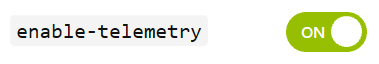
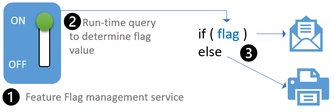
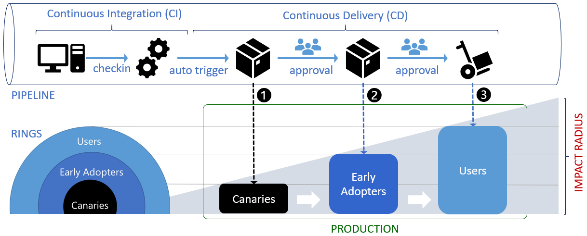

# Is the relationship between feature flags and the ring deployment model symbiotic?

DevOps enables us to deliver at speed, learn from production feedback, make better decisions, and increase customer satisfaction, acquisition and retention. We need to fail fast on features that result in indifference or negative user experience and focus on features that make a positive difference. **Progressive exposure** is a DevOps practise, based on **feature flags** and **ring-based deployment** that allows us to expose features to selected users in production, to observe and validate, before exposing all users.

You're probably asking yourself whether to use ring-based deployments, feature flags, or both to support progressive exposure in your environment. Let's start by exploring both strategies.

## Let's understand what feature flags and rings are for

**Feature Flags** - The earliest reference to feature flags we've found comes from [Martin Fowler](https://martinfowler.com/bliki/FeatureToggle.html). Flags decouple deployment and exposure, give run-time control down to the individual user, and enable hypothesis-driven development. Using and tying feature flags back to telemetry, allows you to decide if a feature helped to increase user satisfaction, acquisition, and retention. You can also use feature flags to do an emergency roll-back, hide a feature in a region where it shouldn't be available, or enable telemetry as needed.

A typical feature flag implementation is based on (1) a feature flag implementation service that defines the flag, (2) a run-time query to figure out the value of the flag, and (3) an if-else programming construct, as shown:

**Ring-based deployment** was first discussed in Jez Humble's book [Continuous Delivery](https://www.continuousdelivery.com/), as Canary-deployments. Rings limit impact on end-users, while gradually deploying and confirming change in **production**. With rings we evaluate the impact, "blast radius", through observation, testing, diagnosis of telemetry, and most importantly, user feedback. Rings make it possible to have multiple production releases running in parallel. You can gather feedback without being at risk of affecting all users, decommission old releases, and distribute new releases when you are confident that everything is working properly.

The following diagram show an implementation of the ring-based deployment process:

When your developers commit a pull request with proposed changes to the master branch, (1) a continuous integration build performs the build, unit testing, and triggers an automatic release to the Canary environment in production. When you're confident that the release is ready for user acceptance and exploratory testing in production (2) you approve the release to the Early Adopter ring. Similarly, when you're confident that the release is ready for prime time, (3) you approve the release to the Users ring. The names and number of rings depends on your preferences, but it's important that all rings are using the same production environment.

Both the **feature flags** and **ring deployment model** strategies are invaluable, whether you're working with a part-time community working on open source [extensions](https://aka.ms/vsarsolutions#Extensions), or [moving 65,000 engineers to DevOps](https://aka.ms/devops).

## Back to the question. Should you use the feature flags, or rings, or both?

The quote “You do not respond to a mosquito bite with a hammer.”, by Patrick L.O. Lumumba, comes to mind. You can use either the ring deployment model or the feature flag strategy to implement the progressive exposure DevOps practice - in other words, there's no definitive answer.

We use both rings and feature flags to progressively expose a new **release** in production, whether it's a hot fix or feature release for our commercial product, affecting 65,000 engineers and eventually hundred of thousand of users as the blast or impact radius of the release increases.

We primarily use the deployment ring strategy for our part-time open source extensions, affecting up to a few thousand users, as outlined in the table below. We're selectively implementing feature flags, as needed, to minimize technical debt while we gather experience with flags. See our [feature flag blogs](https://blogs.msdn.microsoft.com/visualstudioalmrangers/tag/launchdarkly/) for details.

Feature flags allow us to [progressively reveal](https://youtu.be/ed3ziUDq_n0) new **features** of each release, perform A|B testing, and experiment in production. Because we're working with cloud services and extensions, we have a continuous feedback loop with our users and the ability to fine tune each release by toggling feature flags.

The [quasi-continuous delivery mode](https://code.facebook.com/posts/270314900139291/rapid-release-at-massive-scale/) is another simplified example of using both strategies to deploy new features to 1% of the users in the first ring, then 20%, 50%, and 100%, continuing with the same pattern to the second ring, and so on.

I think of a  when I'm using the **ring deployment** model to deploy a release and a  when using **feature flags** to fine tune the release. 

So, the answer to the "rings and/or feature flags" question essentially boils down to how cautious you want to be when rolling out features. I strongly recommend that you you experiment with both.

Happy flagging and ringing!

---

Table comparing rings with flags within the context of our open source [extensions](https://aka.ms/vsarsolutions#Extensions):

|     |DEPLOYMENT RING|FEATURE FLAG|
|-----|---------------|------------|
|Progressive exposure|Yes|Yes|
|A/B Testing|All users within ring|All or selected users within ring|
|Cost|Production environment maintenance|Feature Flag database and code maintenance|
|Primary use|Manage impact "blast radius"|Show or hide features in a release|
|Blast radius - Canaries|0-9 users|0, all, or specific canary users|
|Blast radius - Early Adopters|10-100 users|0, all, or specific early adopter users|
|Blast radius - Users|10000+ of users|0, all, or specific users|